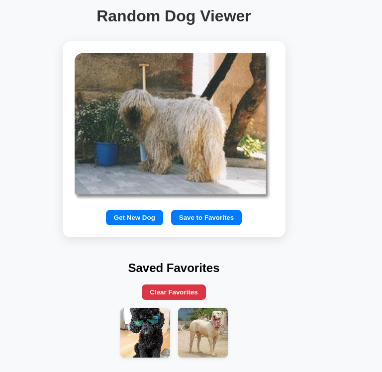

# React Simple Data Fetching Lab



## Learning Goals

- Use the `useEffect` hook to fetch data from an API and set state

## Deliverables

This lab is missing the `App` component that `index.js` is looking for. To pass
the tests in this lab:

- Create an `App` component from scratch
- Use the `useEffect` hook in the `App` component. Inside the callback for
  `useEffect`, send a `fetch` request to
  `https://dog.ceo/api/breeds/image/random`, a free API that returns a random
  image of a dog.
- Display a `<p>` tag with the text of "Loading..." when the component is first
  rendered
- After receiving a response from the API, show the dog image in an `` tag,
  with the `alt` attribute set to "A Random Dog".


## Features

**Fetch Random Dog Images**  
Fetches images from the [Dog CEO API](https://dog.ceo/dog-api/) on page load and via a button.

**Loading Spinner**  
Displays an animated spinner while the API is fetching data.

**Interactive Buttons**  
- **Get New Dog** — Fetch a new random image
- **Save to Favorites** — Save your favorite dogs

**Favorites Gallery**  
- Shows all saved dog images
- Saves favorites in **localStorage**
- Includes a **🗑️ Clear Favorites** button

**Responsive and Clean UI**  
- Styled using basic CSS
- Responsive layout with card UI and gallery

---

## Setup Instructions

1. Clone the repository:
   ```bash
   git clone https://github.com/AmedDavid/react-hooks-simple-data-fetching-lab.git
   cd random-dog
   ```

2. Install dependencies:
   ```bash
   npm install
   ```

3. Start the development server:
   ```bash
   npm start
   ```

4. Visit in browser:  
   `http://localhost:3000`

---

## Issues Faced During Development

- **Infinite Loading**: Initially forgot to include the dependency array `[]` in the `useEffect` hook, causing infinite fetch calls.
- **Image Flashing**: When fetching new dogs, the previous image flashed briefly before updating. Solved by showing the spinner during fetch.
- **Favorites Persistence**: Favorites were not saved between reloads. Fixed by integrating `localStorage`.
- **Duplicate Favorites**: Initially allowed duplicate saves. Added a check to prevent this.
- **Styling Clutter**: The gallery and actions looked crowded. Solved by using Flexbox and better spacing.

---

## Resources

- [React `fetch` with `useEffect` Example][react ajax]

[react ajax]: https://reactjs.org/docs/faq-ajax.html#example-using-ajax-results-to-set-local-state
